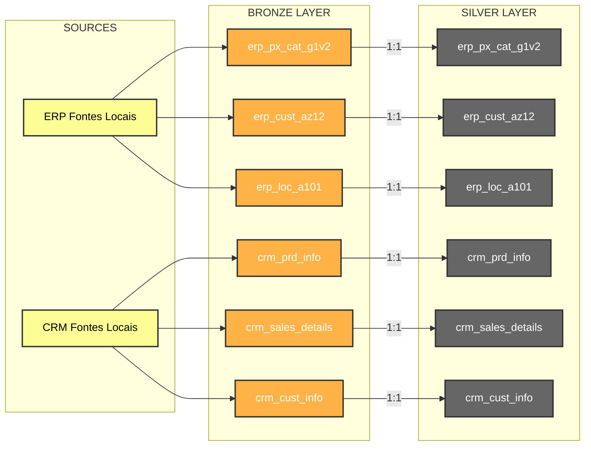

# ETL Process (Bronze to Silver)

This diagram represents the ETL (Extract, Transform, Load) mapping from the Bronze layer to the Silver layer. In this phase, data is cleansed and standardized, maintaining a 1:1 table relationship.

