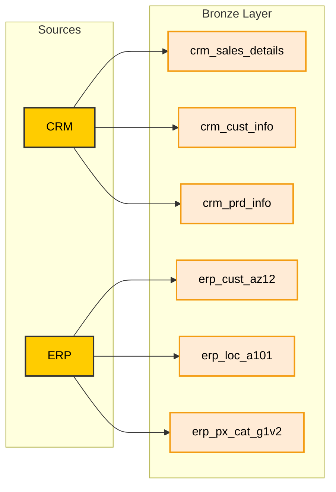

# Data Architecture (Data Ingestion)

This document illustrates the initial phase of the data pipeline, showing how raw data is extracted from the local transactional systems (CRM and ERP) and loaded into the Bronze Layer.

