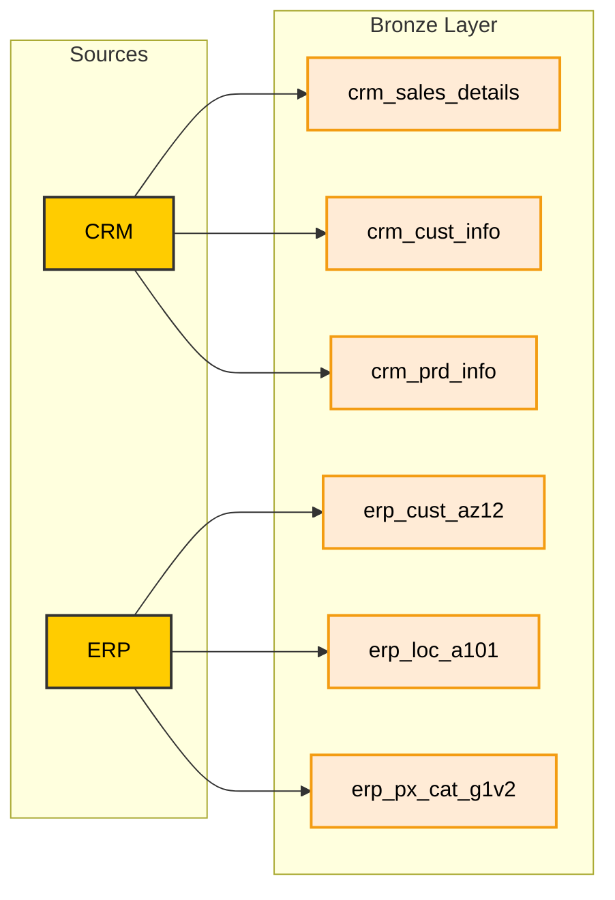
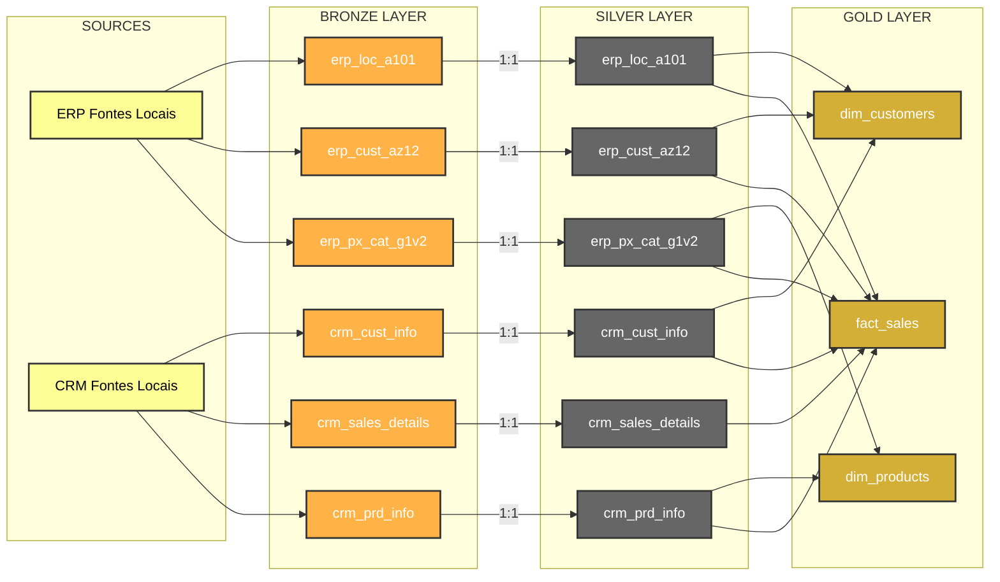

# Data Flow Diagram (Pipeline Architecture)

This document describes the data flow architecture of the SQL Data Warehouse project, mapping the lifecycle of data from transactional sources into the final analytical layers.

## 1. Data Ingestion (Sources to Bronze Layer)
The initial phase extracts raw data directly from local transactional systems (CRM and ERP) and loads it without modifications into the Bronze layer.

## 2. Complete End-to-End Architecture
Once loaded into the Bronze layer, the data is cleansed, standardized, and transformed through the Silver and Gold layers.

