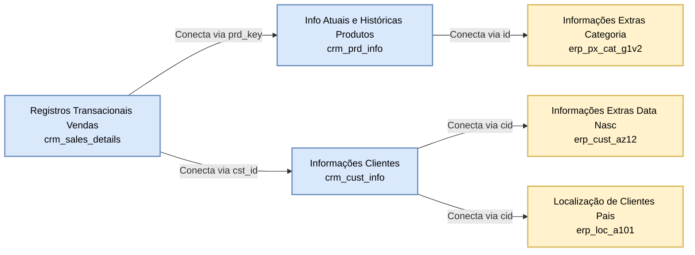

# Data Integration Mapping

This diagram details how the distinct tables from the CRM and ERP systems relate to each other using specific foreign keys (like `prd_key`, `cst_id`, etc.) to form a unified view of Customers, Products, and Sales.

