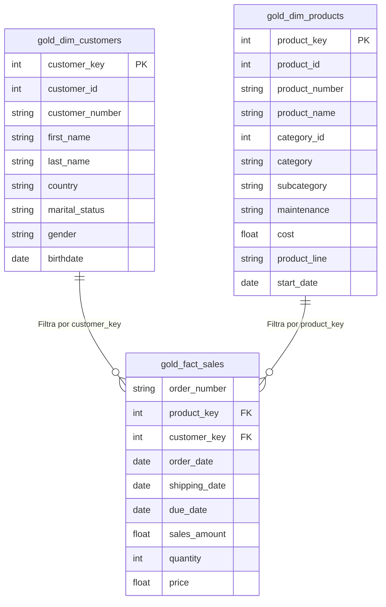

# Data Model (Sales Data Mart - Star Schema)

This document contains the entity-relationship diagram (ERD) representing the dimensional model deployed in the Gold layer. The architecture follows a **Star Schema** optimized for analytical queries.

